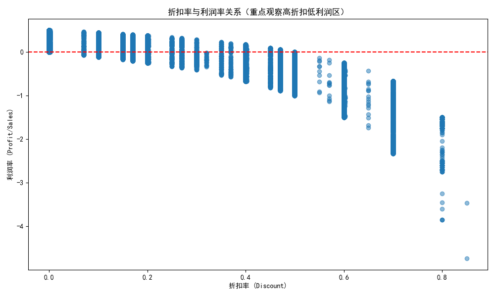
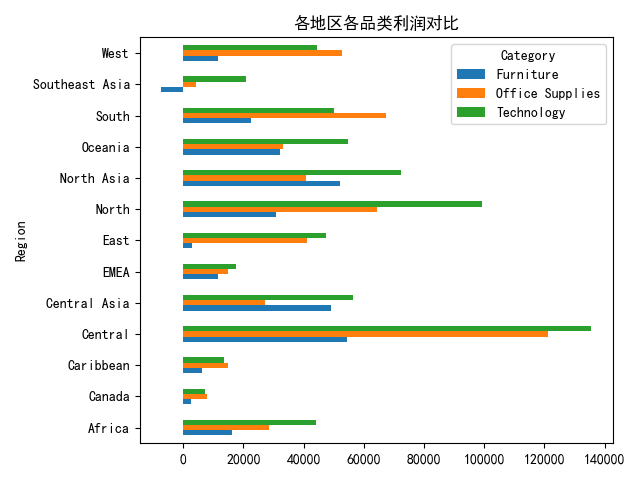

# 📊 Superstore Profit Dashboard

> 基于 Global Superstore 订单数据的多维度利润分析项目，使用 Python、SQL 与 Power BI 完成数据处理、分析与可视化。

---

## 🎯 项目简介

本项目围绕 **Superstore 数据集**展开，目标是挖掘各地区、品类与折扣策略对**利润**的影响，为经营决策提供数据支持。

- **数据量**：51,290 行 × 24 列（订单明细）
- **分析维度**：地区、品类、折扣、利润率、销售额
- **技术栈**：`Python` · `Pandas` · `Matplotlib` · `SQL` · `Power BI`

---

## 📁 目录结构

```
projectB-superstore-profit-dashboard/
├── convert_to_csv.py        # Excel → CSV 数据转换脚本
├── requirements.txt        # Python 依赖清单
├── README.md
├── data/
│   ├── global superstore.xls   # 原始数据（已 gitignore）
│   └── global_superstore.csv   # 转换后的标准数据
├── notebooks/              # 探索性分析笔记
├── output/                  # 可视化图表（见下方）
├── reports/                 # 分析报告
└── sql/                     # SQL 分析脚本
```

---

## 🚀 快速开始

```powershell
# 1. 克隆仓库
git clone https://github.com/<你的用户名>/projectB-superstore-profit-dashboard.git
cd projectB-superstore-profit-dashboard

# 2. 安装依赖
pip install -r requirements.txt

# 3. 数据转换（Excel → CSV）
python convert_to_csv.py

# 4. 运行分析脚本，生成图表
python analysis_b.py
```

---

## 📈 可视化结果

### 各地区利润对比
> Central 地区利润最高（接近 300,000），North 次之；Canada、Southeast Asia 等地区利润较低。



### 折扣与利润率关系
> 散点图展示折扣力度与利润率的相关性，识别"高折扣低利润"的优化区间。


### 地区 × 品类利润分析
> 交叉分析各地区的品类表现，定位优势品类与亏损品类。



---

## 🔍 关键结论

| 指标 | 发现 |
|---|---|
| **最盈利地区** | Central（利润接近 300,000） |
| **利润率规律** | 折扣越高，利润率普遍越低 |
| **品类差异** | 各地区优势品类差异显著 |

---

## 📦 依赖环境

详见 [`requirements.txt`](requirements.txt)：

```
pandas>=2.0
matplotlib>=3.7
openpyxl>=3.1
xlrd==1.2.0
```

---

## 📝 License

MIT License — 仅供学习与交流使用。
